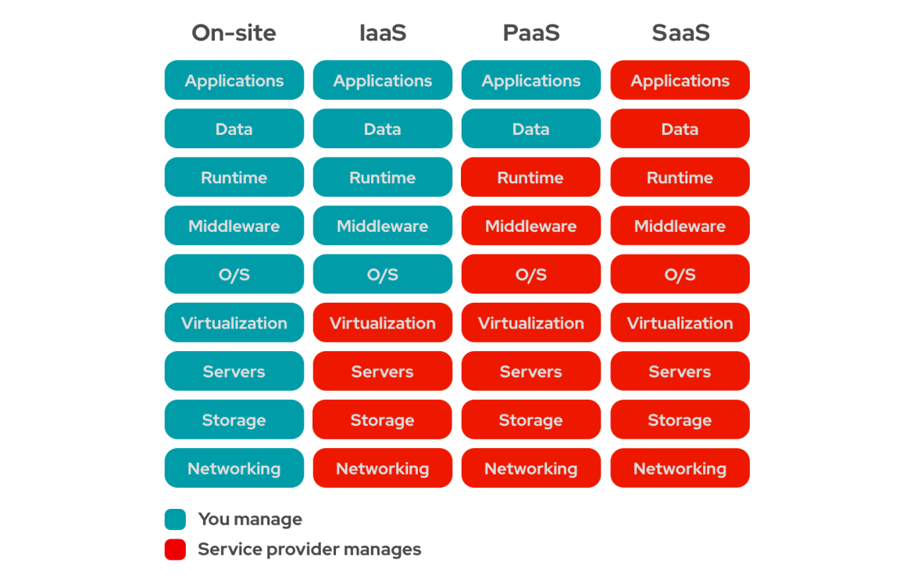

## What is Cloud Computing?

- 인터넷을 통해 컴퓨팅 자원(서버, 스토리지, 네트워크 등)을 제공하는 서비스
- 필요에 따라 자원을 유연하게 확장하거나 축소 가능
- 사용한 만큼 비용을 지불하는 종량제 모델

## Characteristics of Cloud Computing

1. On-Demand Self-Service
   - 사용자가 필요할 때 즉시 자원을 프로비저닝하고 관리할 수 있음
   - 예: AWS Management Console, Azure Portal

2. Broad Network Access
    - 인터넷을 통해 다양한 디바이스(PC, 스마트폰, 태블릿 등)에서 접근 가능
    - 표준화된 프로토콜과 인터페이스 사용
    - 예: 웹 브라우저, 모바일 앱

3. Resource Pooling
    - 여러 사용자가 공유하는 물리적 자원을 가상화하여 제공
    - 자원의 효율적인 사용과 비용 절감 가능
    - 예: 가상 머신, 컨테이너

4. Rapid Elasticity
    - 필요에 따라 자원을 빠르게 확장하거나 축소 가능
    - 트래픽 변화에 유연하게 대응
    - 예: 오토스케일링 그룹

5. Measured Service
    - 자원 사용량을 모니터링하고 측정하여 과금
    - 투명한 비용 관리 가능
    - 예: AWS CloudWatch, Azure Monitor

## Cloud Computing Enabling Technologies

1. Virtualization
   - 물리적 자원(Cpu, Network, Storage)을 가상화하여 여러 가상 머신이 하나의 물리적 서버에서 실행될 수 있도록 함
   - 예: VMware, KVM, Hyper-V

2. Distributed Computing
   - 여러 컴퓨터가 네트워크를 통해 협력하여 작업을 수행전통적인 방식

   - 대규모 데이터 처리와 고가용성 제공
   - 예: Hadoop, Apache Spark

3. Automation and Orchestration
   - 반복적인 작업을 자동화하고, 여러 시스템 간의 작업을 조율
   - 효율적인 자원 관리와 운영 가능
   - 예: Ansible, Terraform, Kubernetes

4. Service-Oriented Architecture (SOA)
    - 독립적인 서비스들이 상호작용하여 애플리케이션을 구성
    - 재사용성과 유연성 향상
    - 예: RESTful API, SOAP

## Cloud Computing Delivery and Deployment Models

### Cloud Computing Delivery Models

On-Site

- 물리적인 서버를 구매하고, 데이터 센터에 설치
- 서버의 유지보수, 업그레이드, 확장 등 모든 작업을 직접 수행
- 초기 비용이 많이 들고, 확장성이 제한적

SaaS (Software as a Service)

- 소프트웨어를 서비스 형태로 제공
- 사용자는 소프트웨어를 설치하거나 유지보수할 필요 없이 인터넷을 통해 접근
- 예: Google Workspace, Microsoft 365

PaaS (Platform as a Service)

- 애플리케이션 개발을 위한 플랫폼 제공
- 개발자는 인프라 관리에 신경 쓸 필요 없이 애플리케이션 개발에 집중
- 예: Heroku, Google App Engine

IaaS (Infrastructure as a Service)

- 가상화된 컴퓨팅 자원 제공
- 사용자는 서버, 스토리지, 네트워크 등 인프라를 직접 관리
- 예: Amazon EC2, Google Compute Engine, OpenStack

### Cloud Computing Deployment Models

1. Public Cloud
   - 인터넷을 통해 일반 대중에게 제공되는 클라우드 서비스
   - 자원은 클라우드 서비스 제공업체가 소유하고 관리
   - 예: AWS, Microsoft Azure, Google Cloud Platform

2. Private Cloud
    - 특정 조직이나 기업을 위해 전용으로 제공되는 클라우드 서비스
    - 자원은 조직 내부 또는 외부 데이터 센터에 위치
    - 보안과 제어가 강화됨
    - 예: OpenStack, VMware vSphere

3. Hybrid Cloud
    - 퍼블릭 클라우드와 프라이빗 클라우드를 결합한 모델
    - 워크로드를 유연하게 분산하고, 보안 요구사항을 충족
    - 예: AWS Outposts, Azure Stack